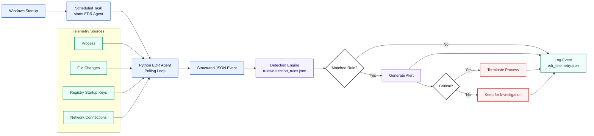
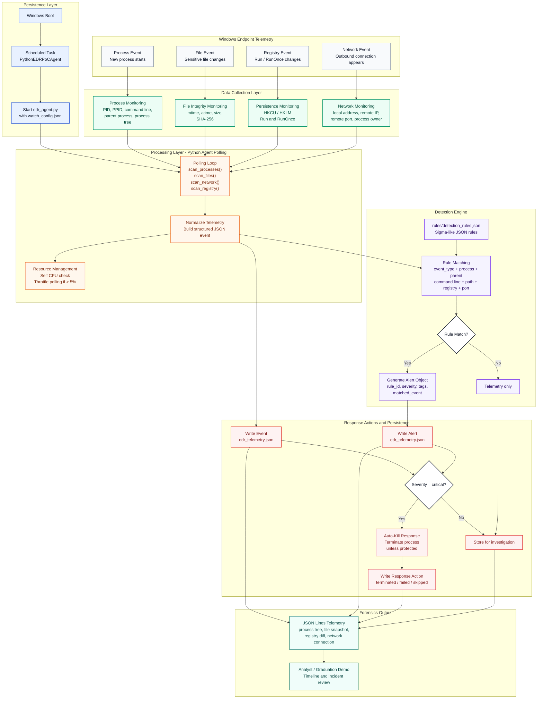

# EDR Data Flow Mermaid Diagram

## Simple Version

```mermaid
flowchart LR
    START["Windows Startup"] --> TASK["Scheduled Task<br/>starts EDR Agent"]

    subgraph SOURCES["Telemetry Sources"]
        PROC["Process"]
        FILE["File Changes"]
        REG["Registry Startup Keys"]
        NET["Network Connections"]
    end

    TASK --> AGENT["Python EDR Agent<br/>Polling Loop"]

    PROC --> AGENT
    FILE --> AGENT
    REG --> AGENT
    NET --> AGENT

    AGENT --> EVENT["Structured JSON Event"]
    EVENT --> RULES["Detection Engine<br/>rules/detection_rules.json"]
    RULES --> DECISION{"Matched Rule?"}

    DECISION -- "No" --> TELEMETRY["Log Event<br/>edr_telemetry.json"]
    DECISION -- "Yes" --> ALERT["Generate Alert"]
    ALERT --> TELEMETRY
    ALERT --> CRITICAL{"Critical?"}
    CRITICAL -- "Yes" --> KILL["Terminate Process"]
    CRITICAL -- "No" --> KEEP["Keep for Investigation"]
    KILL --> TELEMETRY
    KEEP --> TELEMETRY

    classDef source fill:#ECFDF5,stroke:#059669,stroke-width:1.5px,color:#064E3B;
    classDef agent fill:#E8F1FF,stroke:#1D4ED8,stroke-width:1.5px,color:#0F172A;
    classDef detect fill:#F5F3FF,stroke:#7C3AED,stroke-width:1.5px,color:#2E1065;
    classDef response fill:#FEF2F2,stroke:#DC2626,stroke-width:1.5px,color:#7F1D1D;
    classDef output fill:#F0FDFA,stroke:#0F766E,stroke-width:1.5px,color:#134E4A;
    classDef decision fill:#FFFFFF,stroke:#111827,stroke-width:1.7px,color:#111827;

    class PROC,FILE,REG,NET source;
    class START,TASK,AGENT,EVENT agent;
    class RULES,ALERT detect;
    class KILL,KEEP response;
    class TELEMETRY output;
    class DECISION,CRITICAL decision;
```

## Detailed Version

```mermaid
flowchart TB
    %% =======================
    %% Persistence Layer
    %% =======================
    subgraph PERSIST["Persistence Layer"]
        direction TB
        BOOT["Windows Boot"]
        TASK["Scheduled Task<br/>PythonEDRPoCAgent"]
        AGENT_START["Start edr_agent.py<br/>with watch_config.json"]
        BOOT --> TASK --> AGENT_START
    end

    %% =======================
    %% Windows Telemetry Sources
    %% =======================
    subgraph WINDOWS["Windows Endpoint Telemetry"]
        direction LR
        PROC_EVENT["Process Event<br/>New process starts"]
        FILE_EVENT["File Event<br/>Sensitive file changes"]
        REG_EVENT["Registry Event<br/>Run / RunOnce changes"]
        NET_EVENT["Network Event<br/>Outbound connection appears"]
    end

    %% =======================
    %% Data Collection Layer
    %% =======================
    subgraph COLLECT["Data Collection Layer"]
        direction LR
        PROC_MON["Process Monitoring<br/>PID, PPID, command line,<br/>parent process, process tree"]
        FIM_MON["File Integrity Monitoring<br/>mtime, atime, size,<br/>SHA-256"]
        REG_MON["Persistence Monitoring<br/>HKCU / HKLM<br/>Run and RunOnce"]
        NET_MON["Network Monitoring<br/>local address, remote IP,<br/>remote port, process owner"]
    end

    %% =======================
    %% Processing Layer
    %% =======================
    subgraph PROCESSING["Processing Layer - Python Agent Polling"]
        direction TB
        POLL["Polling Loop<br/>scan_processes()<br/>scan_files()<br/>scan_network()<br/>scan_registry()"]
        NORMALIZE["Normalize Telemetry<br/>Build structured JSON event"]
        CPU_GUARD["Resource Management<br/>Self CPU check<br/>Throttle polling if &gt; 5%"]
        POLL --> NORMALIZE --> CPU_GUARD
    end

    %% =======================
    %% Detection Layer
    %% =======================
    subgraph DETECT["Detection Engine"]
        direction TB
        RULES["rules/detection_rules.json<br/>Sigma-like JSON rules"]
        MATCH["Rule Matching<br/>event_type + process + parent<br/>command line + path + registry + port"]
        DECISION{"Rule Match?"}
        ALERT["Generate Alert Object<br/>rule_id, severity, tags,<br/>matched_event"]
        RULES --> MATCH
        MATCH --> DECISION
        DECISION -- "Yes" --> ALERT
        DECISION -- "No" --> NO_ALERT["Telemetry only"]
    end

    %% =======================
    %% Response and Persistence
    %% =======================
    subgraph RESPONSE["Response Actions and Persistence"]
        direction TB
        LOG_EVENT["Write Event<br/>edr_telemetry.json"]
        LOG_ALERT["Write Alert<br/>edr_telemetry.json"]
        CRITICAL{"Severity = critical?"}
        AUTOKILL["Auto-Kill Response<br/>Terminate process<br/>unless protected"]
        ACTION_LOG["Write Response Action<br/>terminated / failed / skipped"]

        LOG_EVENT --> CRITICAL
        LOG_ALERT --> CRITICAL
        CRITICAL -- "Yes" --> AUTOKILL --> ACTION_LOG
        CRITICAL -- "No" --> STORE_ONLY["Store for investigation"]
    end

    %% =======================
    %% Investigation Output
    %% =======================
    subgraph FORENSICS["Forensics Output"]
        direction TB
        TELEMETRY["JSON Lines Telemetry<br/>process tree, file snapshot,<br/>registry diff, network connection"]
        INVESTIGATOR["Analyst / Graduation Demo<br/>Timeline and incident review"]
        TELEMETRY --> INVESTIGATOR
    end

    %% Data flow links
    AGENT_START --> POLL

    PROC_EVENT --> PROC_MON
    FILE_EVENT --> FIM_MON
    REG_EVENT --> REG_MON
    NET_EVENT --> NET_MON

    PROC_MON --> POLL
    FIM_MON --> POLL
    REG_MON --> POLL
    NET_MON --> POLL

    NORMALIZE --> LOG_EVENT
    NORMALIZE --> MATCH
    ALERT --> LOG_ALERT
    NO_ALERT --> STORE_ONLY

    LOG_EVENT --> TELEMETRY
    LOG_ALERT --> TELEMETRY
    ACTION_LOG --> TELEMETRY
    STORE_ONLY --> TELEMETRY

    %% Professional styling
    classDef persistence fill:#E8F1FF,stroke:#1D4ED8,stroke-width:1.5px,color:#0F172A;
    classDef source fill:#F8FAFC,stroke:#64748B,stroke-width:1.2px,color:#0F172A;
    classDef collector fill:#ECFDF5,stroke:#059669,stroke-width:1.5px,color:#064E3B;
    classDef processing fill:#FFF7ED,stroke:#EA580C,stroke-width:1.5px,color:#7C2D12;
    classDef detection fill:#F5F3FF,stroke:#7C3AED,stroke-width:1.5px,color:#2E1065;
    classDef response fill:#FEF2F2,stroke:#DC2626,stroke-width:1.5px,color:#7F1D1D;
    classDef output fill:#F0FDFA,stroke:#0F766E,stroke-width:1.5px,color:#134E4A;
    classDef decision fill:#FFFFFF,stroke:#111827,stroke-width:1.7px,color:#111827;

    class BOOT,TASK,AGENT_START persistence;
    class PROC_EVENT,FILE_EVENT,REG_EVENT,NET_EVENT source;
    class PROC_MON,FIM_MON,REG_MON,NET_MON collector;
    class POLL,NORMALIZE,CPU_GUARD processing;
    class RULES,MATCH,ALERT,NO_ALERT detection;
    class DECISION,CRITICAL decision;
    class LOG_EVENT,LOG_ALERT,AUTOKILL,ACTION_LOG,STORE_ONLY response;
    class TELEMETRY,INVESTIGATOR output;
```
